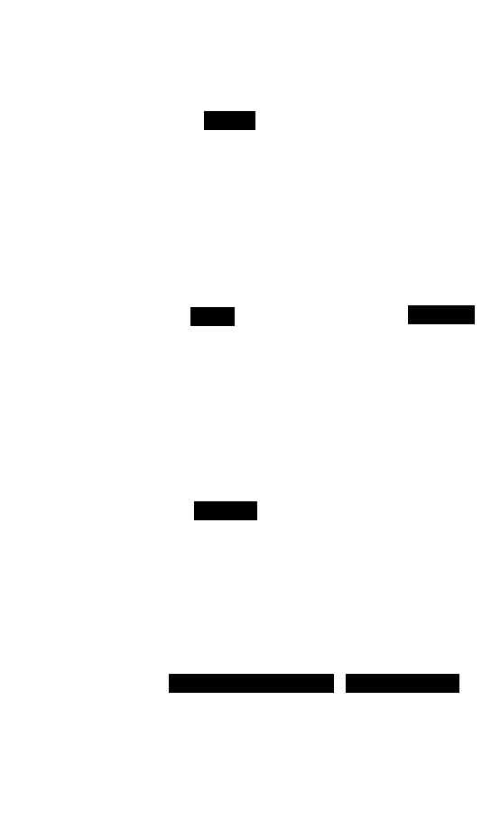

# Architecture

How the runtime is put together, and the path a connection takes from a listening
port to a Session coroutine. Read `README.md` first for the shape and the rationale;
this is the map.



<!-- Diagram: assets/architecture.svg. Edit the D2 source below and re-render with:
     d2 --theme 0 --pad 20 <this-source>.d2 assets/architecture.svg

```d2
# reactor: a connection's life and the offload that keeps the loop free.
direction: down
c: "client" { style.fill: "#faf3e6" }
acc: "acceptor\n(SO_REUSEPORT: one per reactor, or one round-robin)" { style.fill: "#eef2f7" }
r: "reactor loop\n(io_context, one thread)" { style.fill: "#e8f5ee" }
co: "per-connection coroutine\n(reads framed messages)" { style.fill: "#e8f5ee" }
pool: "offload thread-pool\n(bounded gate; blocking work)" { style.fill: "#eef2f7" }
c -> acc: "connect"
acc -> r: "accept"
r -> co: "co_spawn"
co -> pool: "co_await (blocking IO/CPU)"
pool -> co: "resume with result"
co -> c: "write reply"
```
-->

## Dependencies

Just **[asio](https://think-async.com/Asio/)** (standalone, `ASIO_STANDALONE`), pulled
in by CMake `FetchContent`; otherwise header-only and standard-library only. The
protocol/session, logging, and any application state are supplied *above* the runtime,
not depended on here (see [What lives above](#what-lives-above-not-here)).

## One layer, one job

The library is two headers — `reactor.h` (TCP) and `reactor_udp.h` (UDP) — drawing one
seam: the **runtime** below, the **protocol** above. Everything here is transport
mechanics — loops, threads, acceptors/sockets, offload, shutdown. Nothing here knows a
wire format.

```
      protocol:  Session = awaitable<void>(socket, Reactor&)    -- TCP: you write this
                 Datagram = void(string_view, udp::endpoint)    -- UDP: you write this
     ------------------------------ the seam --------------------------------
  runtime   TcpServer     N reactors on N threads, one port, a Session per connection
            UdpServer     one reactor, one bound UDP socket, a Datagram per packet
            Reactor       one io_context (one thread) + offload pool + gate + abortables
            OffloadGate   bounded offload admission (shed when full)
            Abortable     something shutdown must release so a blocked worker unwedges
            BindOptions   TCP: address / reuse_port / tcp_nodelay / backlog
            UdpOptions    UDP: reuse_addr/port, multicast group/interface/loop/ttl, buffers
            detail::accept_loop / shared_accept_loop   the two bind strategies
```

The two transports share `Reactor` (the io_context + offload pool + abortable registry)
and the abort→stop→join shutdown; they differ only in the connection model — TCP accepts
and spawns a Session coroutine per connection, UDP runs one receive loop and calls the
Datagram handler per packet. UDP has no accept and no per-connection state, so its
`UdpServer` is a single reactor (a gossip protocol is single-threaded); it exposes `io()`
so the protocol's own timers run on that same loop.

## Runtime: shared-nothing reactors

A `TcpServer` runs **N `io_context`s on N threads** — thread-per-core, no shared
state between them, no global lock, no cross-core bounce. Each `Reactor` also owns an
optional Asio `thread_pool` for offload and a bounded offload window.

```
  TcpServer(reactors=4, workers=2, queue=256, session)
    Reactor 0  [ io_context | thread ]  + thread_pool(2)  + gate  + abortables
    Reactor 1  [ io_context | thread ]  + thread_pool(2)  + gate  + abortables
    Reactor 2  [ io_context | thread ]  + thread_pool(2)  + gate  + abortables
    Reactor 3  [ io_context | thread ]  + thread_pool(2)  + gate  + abortables
```

A reactor's `io_context` is constructed with a concurrency hint of `1` (a single
thread runs it), which lets Asio skip internal locking on the per-reactor loop.

## Binding N reactors to one port

Two modes, chosen automatically in `start()`:

- **`SO_REUSEPORT` (Linux), `detail::accept_loop`.** Each reactor binds *its own*
  acceptor on the same port; the kernel load-balances incoming connections across
  them. No shared acceptor, no funnel. The fast path — opt in with
  `BindOptions::reuse_port = true`.

- **Portable shared acceptor, `detail::shared_accept_loop`.** One acceptor (on
  reactor 0's loop) binds the port once and accepts each connection *directly onto*
  a target reactor's `io_context`, round-robin. Only the cheap accept funnels; the
  connection's actual work shards across all reactors. This is the default, and the
  only option on macOS/BSD, which reject a second same-port bind without
  `SO_REUSEPORT`.

The choice: `shared = !reuse_port && reactors > 1`. A single reactor, or
`reuse_port` on Linux, takes the per-reactor acceptor path.

### The idle-reactor work guard

In shared-acceptor mode the acceptor lives on reactor 0, so reactors 1..N-1 have no
pending work when their threads start — and `io_context::run()` returns immediately
when it runs out of work. Each reactor gets an `executor_work_guard` before its
thread starts, so `run()` blocks until `stop()` clears the guards, rather than the
thread falling through and exiting before the first connection is ever routed to it.

## A connection's life

```
  client connects
      -> acceptor accepts (per-reactor, or shared -> round-robin onto reactor r)
      -> co_spawn( session(socket, r) )  on r's io_context, detached
      -> your Session coroutine runs the whole connection:
             read bytes ... maybe co_await r.pool() for blocking work ... write ...
             keep-alive loop ... co_return on EOF/close
```

The Session owns the connection start to finish. Framing, parsing, dispatch,
back-pressure, keep-alive — all yours. The runtime only accepted the socket and
picked the reactor.

## Offload: keeping the loop free

Blocking or CPU-heavy work must not run on a reactor thread — it would stall every
other connection on that loop. A Session offloads it to its reactor's pool:

```cpp
auto result = co_await asio::co_spawn(r.pool()->get_executor(),
    [&]() -> asio::awaitable<T> { co_return do_blocking_work(); },
    asio::use_awaitable);
```

`OffloadGate` bounds how much offload is admitted at once. `gate().try_enter()`
returning `false` is the "busy" signal — the Session answers with whatever its
protocol uses (an HTTP 503, a NAK, a drop) instead of letting the pool's backlog
grow without limit. A `workers == 0` reactor has no pool (`pool()` is null), meaning
"run everything inline on the loop".

## Shutdown: abort, stop, join — in that order

The hard part of any server runtime. A worker can be parked deep in a `co_await` —
a streaming read waiting for more request body, a receive waiting on a queue that
will never fill — and simply stopping the `io_context` would strand it and hang the
join. So `stop()` runs a strict order:

```
  stop():
    1. reactor.abort_all()   for every reactor  -- release Abortables; blocked workers unwedge
    2. clear work guards                          -- idle reactors may now drain
    3. io.stop()             for every reactor    -- stop the loops
    4. thread.join()         for every thread     -- loops have exited; joins return
    5. pool.stop() + join()  for every pool        -- drain offload
```

Anything a Session can block on registers with `Reactor::track()` as an `Abortable`;
step 1 calls its `abort()`. `track()` holds `weak_ptr`s and prunes expired entries,
so a connection that finished normally leaves nothing behind. The destructor calls
`stop()`, so a `TcpServer` going out of scope tears down cleanly on its own.

## UDP: the connectionless path (`reactor_udp.h`)

`UdpServer` reuses `Reactor` but replaces accept-and-Session with bind-and-receive:

```
  UdpServer(on_datagram)  ->  one Reactor (io_context + thread)
      start(port):
        open + set options (reuse_addr/port, SND/RCV buffers)
        if multicast:  enable_loopback, ttl, outbound_interface (IP_MULTICAST_IF)
        bind(port)                 -- THROWS on failure (the app decides what that means)
        if multicast:  join_group(group[, interface])   -- and remember group:port for send()
        co_spawn(receive_loop)     -- async_receive_from -> on_datagram(bytes, from), forever
        run() on the thread
      send(data)      -> send_to(data, group:port)
      send_to(d, ep)  -> one datagram to ep
      stop()          -> abort_all -> io.stop() -> join -> drain pool  (same order as TCP)
```

Two things are load-bearing and specific to UDP:

- **The datagram handler and the protocol's timers share one thread.** A gossip/Raft
  protocol keeps a lot of state (terms, votes, peer tables) that a single loop mutates
  without locks. So `UdpServer` is deliberately one reactor, and it exposes `io()` so the
  protocol schedules its `steady_timer`s and cross-thread `post`s onto that *same* loop —
  the receive and the timers never race. `send()`/`send_to()` may be called from any
  thread (UDP send and receive are independent directions), but a strict-ordering
  protocol posts its sends onto `io()` too.
- **Multicast interface selection.** Sending to a group uses the OS's default-route
  interface unless `multicast_interface` pins `IP_MULTICAST_IF`; a VPN/utun default route
  frequently can't carry multicast, so pinning the loopback interface keeps a one-host
  cluster's gossip self-contained. The join uses the same interface. `INADDR_ANY` (the
  default) matches the classic transport.

## What lives above (not here)

The protocol. Message enums and a dispatch switch, framing (`[type][len][payload]`
vs an HTTP request line vs a UDP datagram header), file streaming, keep-alive
policy, the parser and writer — every bit of that is the Session's. This library is
deliberately the part that is identical across all of them.
